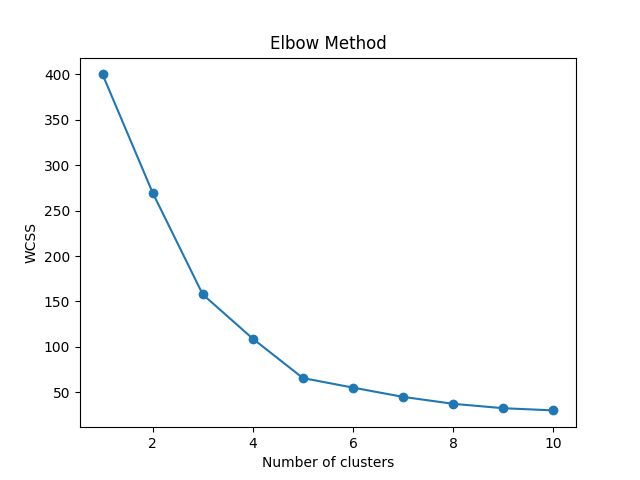

```markdown
# 🛍️ Customer Segmentation using K-Means Clustering

This project segments mall customers into distinct groups based on **Annual Income** and **Spending Score**, using unsupervised machine learning (K-Means). It includes an interactive **Streamlit web app** for live predictions, visualizations, and downloads.

## 📌 Project Goals

- Perform customer segmentation using K-Means
- Visualize cluster formation using Elbow and Scatter plots
- Evaluate cluster quality using Silhouette Score
- Build an interactive web app to upload, cluster, and download customer data

## 🧠 Tech Stack

| Layer        | Tools Used                      |
|--------------|---------------------------------|
| Language     | Python 3.x                      |
| ML Libraries | scikit-learn, pandas, numpy     |
| Plotting     | matplotlib, seaborn             |
| App Framework| Streamlit                       |
| Deployment   | GitHub + (optional Streamlit Cloud) |

## 📁 Project Structure

```

customer-segmentation-ml/
├── app.py
├── cluster\_plot.png
├── elbow\_plot.png
├── data/
│   └── Mall\_Customers.csv
├── models/
│   ├── kmeans\_model.pkl
│   └── scaler.pkl
├── notebooks/
│   └── customer\_segmentation.ipynb
├── src/
│   └── customer\_segmentation.py
├── requirements.txt
└── README.md

````

## 📊 Dataset

**Source:** https://www.kaggle.com/datasets/vjchoudhary7/customer-segmentation-tutorial-in-python  
**Columns Used:**
- Annual Income (k$)
- Spending Score (1-100)

## 🚀 Setup & Run Locally

### 1️⃣ Clone the Repository

```bash
git clone https://github.com/YOUR_USERNAME/customer-segmentation-ml.git
cd customer-segmentation-ml
````

### 2️⃣ Create & Activate Virtual Environment

```bash
python -m venv venv
venv\Scripts\activate     # On Windows
source venv/bin/activate  # On macOS/Linux
```

### 3️⃣ Install Dependencies

```bash
pip install -r requirements.txt
```

## 🏋️‍♂️ Model Training

```bash
python src/customer_segmentation.py
```

Outputs:

* models/kmeans\_model.pkl
* models/scaler.pkl
* elbow\_plot.png
* cluster\_plot.png
* Silhouette Score in terminal

## 🌐 Streamlit App

```bash
streamlit run app.py
```

Go to: [http://localhost:8501](http://localhost:8501)

### Features

* Upload CSV with `Annual Income` and `Spending Score`
* View raw data and clustered data
* Cluster visualization (scatter plot)
* Dataset summary
* Pairplot by cluster
* Download clustered CSV

## 📷 Screenshots

### Cluster Visualization


### Elbow Method



## 🔐 .gitignore

```
venv/
__pycache__/
*.pyc
*.pkl
*.csv
```

## 🚀 Deployment (Optional)

* Go to [https://streamlit.io/cloud](https://streamlit.io/cloud)
* Click "New app"
* Choose this repo
* Set app file: `app.py`
* Click Deploy

## 📦 Future Improvements

* User-selectable K value
* PCA for 3D visualization
* Age/Gender based clustering
* Deploy as an API
* Dashboard with Plotly

## 👨‍💻 Author

Created by YOUR\_NAME

```
```
